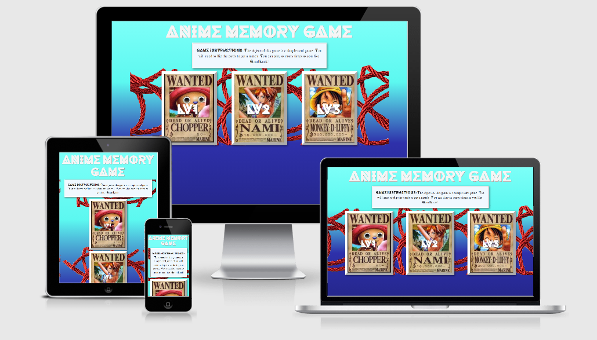
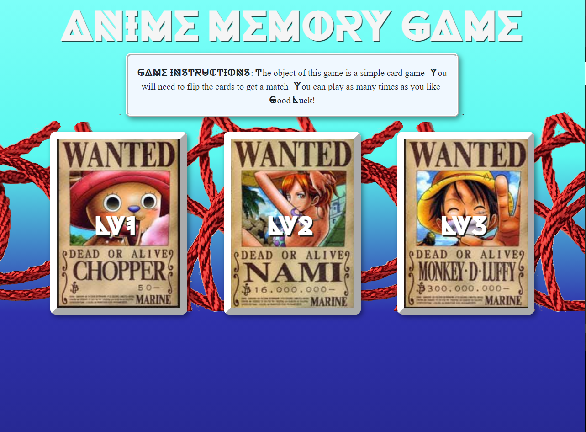
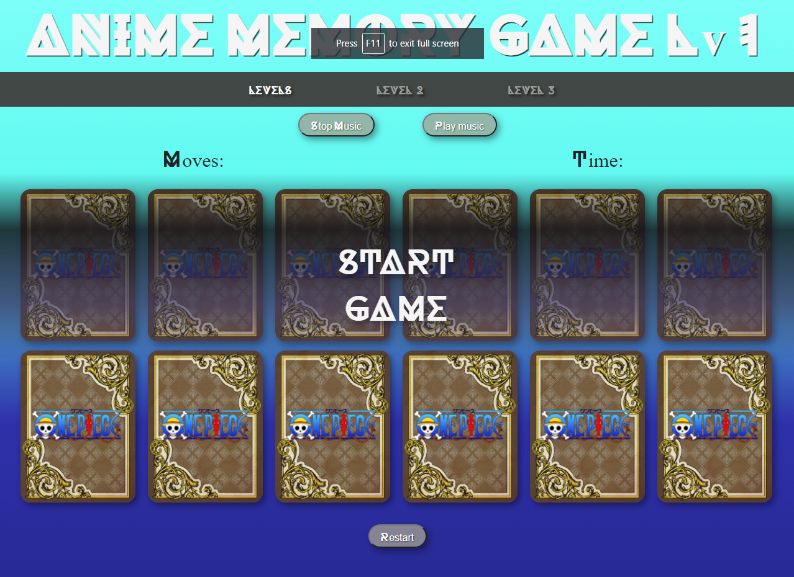
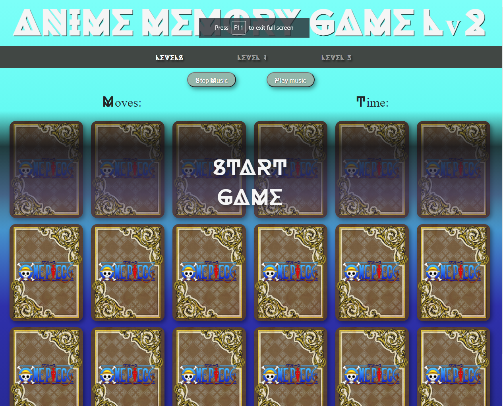
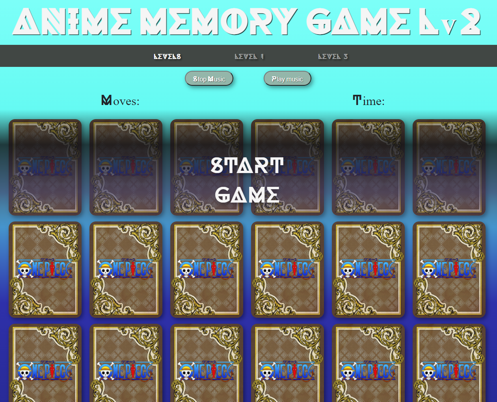

## The Anime Memory Game by Peter Freemantle

# UX

## 1.1 What is the Site About
'The Anime Memory Game' Is a interactive site allowing the user to play 3 different levels of anime related memory game.

## 1.2 What is the Purpose of the Site
The site has a practical and a theoretical purpose:

## Practical:
The practical purpose of this site is to showcase my abilities as a developer and to put into practice the knowledge I have acquired over the period of my course. This site concept of this practical application is to create a site that is interactive through JavaScript and using CSS and html styling, With a view to allow further development, for back end systems and updates to functionality. As such, the site is constructed with Bootstrap as a partial base with custom CSS overlaying and JavaScript functionality to show an understanding of these elements.

## Theoretical:
The goal is to create a page that allows the user access a anime related memory game, to help pass the time and have abit of fun. 

## 1.3 Who Built the Site and Why
This site was conceived, designed and built by Peter Freemantle for his second milestone project "Interactive Frontend Development Milestone Project", as part of his Full-Stack Developer Diploma course from Code Institute, through Edinburgh Napier University. He has been a part of the hospitality industry and a chef from 2008-2020.

## 1.4 Concept
This will be a multiple page interactive website, allowing users to access 3 levels of a anime memory game. The home page will be a panel screen providing navigation to the users desired level choice, header with brand imaging and a footer with notable information. Each respective level page will have a navigation bar, matching banner text and footer and game elements across all pages. In desktop the links will keep across full screen, but move to a burger icon when in mobile, allowing for the content to be kept clear and visible. The new menu will have active screens set, allowing the user to know where they are on the site.

The site will be fully responsive and optimized to be viewed on different screen sizes and devices.

## 1.5 User Stories
As a anime fan with some time to kill why not play a memory game. Well hello theere 'Anime Memory Game' is here to the rescue. Coming off a google search i know what im expecting and want to get straight to it.

## 2 Site Content, Structure Concept and Development

### 2.1 Pages Overview
The website consists of four pages, accessible through the homepage navigation links and a navigation bar at the top of each level page.

* Home Page: Header, footer and a navigation panel consisting of picture links and text for the varying game levels.

* Level 1: Header, nav and game panel made of 12 cards showing blank backs and allowing the play of the memory game.

* Level 2: Header, nav and game panel made of 18 cards showing blank backs and allowing the play of the memory game.

* Level 3: Header, nav and game panel made of 24 cards showing blank backs and allowing the play of the memory game.

### WireFrames from concept

Are all located in a pdf <a href="assets/wireframes/Anime Memory Wirerames.pdf" target="_top">Anime Memory WireFrames</a>

## 3 Technologies Used
### 3.1 HTML or Hyper Text Markup Language
Used to construct all the pages of this web site. For further info on this language; https://developer.mozilla.org/en-US/docs/Web/HTML

### 3.2 CSS or Cascading Style Sheets
Is used to style various elements on a web page via colouring, fonts, spacing, etc. For further info, see this link; https://www.w3.org/Style/CSS/Overview.en.html

### 3.3 Bootstrap
Bootstrap is a potent front-end framework used to create modern websites and web apps. It's open-source and free to use, yet features numerous HTML and CSS templates for UI interface elements such as buttons and forms. Bootstrap also supports JavaScript extensions.For ease of development, Bootstrap [v4.4.1] (https://getbootstrap.com/docs/4.4/getting-started/introduction/) is employed in several areas of the site including:

### 3.4 Chrome DevTools
Web developer tools built directly into the Google Chrome browser. I used these tools at every step to test the functionality of my code. https://developers.google.com/web/tools/chrome-devtools

### 3.5 Javascript
JavaScript, often abbreviated as JS, is a programming language that conforms to the ECMAScript specification. JavaScript is high-level, often just-in-time compiled, and multi-paradigm. It has curly-bracket syntax, dynamic typing, prototype-based object-orientation, and first-class functions

### 3.6 Google Fonts
Fonts are provided by Google Fonts

### 3.7 Gitpod
An online IDE which streamlines developer workflows by providing prebuilt, collaborative development environments in your browser - powered by VS Code. It does not have to be installed on your PC. This website has been constructed using Gitpod IDE

### 3.8 GitHub Repository
This website is hosted on GitHub
GitHub Repository:https://github.com/SdMusic/Anime-Memory-Game
Deployed Link: https://sdmusic.github.io/Anime-Memory-Game/index.html

### 3.9 W3C Markup Validation Service
Used to run all html and CSS code through a validation to identify if the code meets current standards and whether or not it is showing errors. https://validator.w3.org/ https://jigsaw.w3.org/css-validator/validator

### 3.10 JShint service 
Used to run all Javascript through a validation to identify any code not confoming to current standards.
https://jshint.com/

### 4.0 Screenshot - Full Page Screen Capture
This is a chrome extension used to capture full screen images
https://chrome.google.com/webstore/detail/screenshot-full-page-scre/ejkbkgbliokmbblkklofdehalgbplkfg?hl=en

## Deployment

The site is built on Gitpod, with all source code and assets hosted on GitHub. This is done through the following procedure

All files and code once saved is added to a temporary git directory using the [git add .] command.

"Added" files can then be committed to the git repository using the [git commit -m""] command. This requires commenting for each commit allowing you to see the changes that have been made and provide backup points.

The code is uploaded to the GitHub repository through the [git push] command.

Deployment to GitHub pages is done through the GitHub site; through settings, then GitHub pages and setting the live pages URL.

All versions are held on the master branch.

Prior to deployment, the site could be viewed in real time by adding the following command to the terminal window, and selecting "Open Browser" from the modal that displays: python3 -m http.server

## Testing

## Bugs & Fixes
- Timer starts when page loaded - added empty global var and assigned start function to fill
- Game able to be played before timer start - overlay added with pointer null to a start game fuction
- When clicked in quick succesion 3 card can remain displayed. Fixed with global var counting cards flipped and not allowing more than 2 
with var being reset when check match is called.
- Score displayed to decimal point, fixed by putting sum through new var and Math.round().
- Stop timer function not working - Scope changed to correct error.

## Credits and Acknowledgements

### Code snippets
Snippets of code that I edited and used as examples are listed below:
- Button styling: https://fdossena.com/?p=html5cool/buttons/i.frag
- Navs from: (https://getbootstrap.com/docs/4.0/components/navs/)
- Columns from: (https://getbootstrap.com/docs/4.0/layout/grid/)
- Contact Form from: (https://getbootstrap.com/docs/4.0/components/forms/)
- Spacing Utilities - (https://getbootstrap.com/docs/4.0/utilities/spacing/)
- Elements from my previous project including readme format.
- Fireworks css - (https://codepen.io/yshlin/pen/ylDEk)

### Audio from:
- https://www.myinstants.com/
- https://www.voicy.network/tags/luffy
- https://www.youtube.com/watch?v=9vNmQ8cleT4

### Images from: 
- https://shopee.co.th/ope-diy-hand-woven-necklace-rope-bracelet-rope-jade-thread-Chinese-knot-rope-thick-red-rope-pendant-pendant-rope-haybo01-i.132588053.5611983167
- https://www.favicon.cc/?action=icon&file_id=520287
- https://www.wallpaperflare.com/one-piece-poster-anime-2560x1440-one-piece-wanted-poster-wallpaper-udhbx

### Generalised issues and solutions:

- https://stackoverflow.com/
- https://www.w3schools.com/